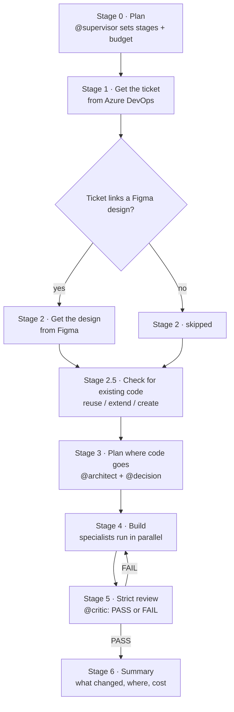

# Architecture

How the whole thing fits together, explained plainly and with diagrams. If you just want to *use*
it, read [DEVELOPER-GUIDE.md](./DEVELOPER-GUIDE.md) instead. This doc is for when you want to know
*how* it works or you're going to extend it.

---

## The big picture

There is **one** repo (this one) that holds all the AI agents, the commands, and the rules. It gets
copied into each of our product repos in the format each editor understands. Developers only ever
see clean agents and commands; the messy runtime (cache, budget, notes) stays hidden.

```
                      eq-sparks  (THE ONE SOURCE — you edit here)
                      agents · orchestrators · skills · guardrails · methodology
                                          │
                          render (two small generator scripts)
                          ┌───────────────┴───────────────┐
                          ▼                                ▼
                    .claude/  (Claude Code)          .github/  (GitHub Copilot)
                    agents, commands, skills         agents/*.agent.md + agents/<category>/, instructions
                          │                                │
                          └──────────────┬─────────────────┘
                                         ▼
                          The developer's editor, in any EQ repo
                                         │
                                         ▼
                    .eq-sparks/  (HIDDEN runtime — cache, budget, memory, telemetry)
```

Two rules that explain almost everything:

1. **You edit the source once.** A small script then generates the `.claude/` and `.github/`
   versions. You never hand-edit those generated folders — they get overwritten.
2. **The runtime is hidden and separate.** Cache, budget tallies, run notes, and telemetry live in
   `.eq-sparks/`, away from both editor folders. Developers don't see it; it's never committed.

---

## The pieces, in plain terms

**Orchestrators** are the commands you run (`/scaffold`, `/fix-defect`, …). Each one runs a whole job
as a series of stages and is the only thing allowed to call agents. There are 12.

**Agents** are the specialists. Each is good at one thing and is told which AI model to use and how
to behave. There are 26, grouped into five categories (below). An orchestrator calls the agents it
needs for the job.

**Skills** are small reusable actions agents share — fetch a ticket, look up the design, check the
cache, hand work to the next agent. There are 10.

**Guardrails** are the rules everyone must follow (never commit secrets, never write duplicate code,
always use the design system, …). They're collected in a registry and enforced by the reviewer.

**The agentic OS** is the hidden machinery that makes it cheap and reliable: a budget so runs can't
run away, a cache so nothing is fetched twice, a memory so a run can be resumed, and telemetry so we
can see what happened.

---

## The 26 agents, by category

**Governance** — run on every job, in charge of quality:
`@supervisor` (plans the run and the budget), `@decision` (makes the call when something's ambiguous),
`@critic` (the strict reviewer that can block a stage).

**Core** — general build, test, and quality:
`@architect`, `@codegen`, `@reviewer`, `@tester`, `@integration-tester`, `@contract-tester`,
`@security`, `@scanner`, `@docs`, `@perf`.

**Frontend (EQOne)** — the UI specialists:
`@mfe`, `@shared-curator`, `@design-system`, `@state`, `@contract`, `@a11y`.

**BFF (ExperienceAPI)** — the backend-for-frontend specialists:
`@domain-folder`, `@bff-shaper`, `@downstream-connector`, `@contract-publisher`.

**Platform** — the cross-cutting ops agents:
`@infra` (reads observability/telemetry, guards deploys), `@db` (database/SQL safety),
`@learner` (proposes lessons from past runs — humans approve them).

---

## What happens when you run `/scaffold` (a worked example)

This is the shape of every orchestrator — only the stages and agents change.



In words:

1. **Plan.** `@supervisor` lays out the stages and sets a budget for the run.
2. **Get the ticket.** It pulls the title, description, and acceptance criteria from Azure DevOps.
3. **Get the design** — only if the ticket links a Figma file (otherwise this stage is skipped, and
   it says so).
4. **Check for existing code.** Before writing anything, it scans the design system, `eq-one-shared`,
   and the sibling MFEs. For each piece it decides: *reuse* what's there, *extend* something close,
   or *create* new. This is how duplicates are prevented.
5. **Plan placement.** `@architect` decides where each piece belongs; `@decision` records the
   reuse/extend/create choices with reasons.
6. **Build.** The specialists (`@mfe`, `@design-system`, `@state`, `@contract`, and the BFF agents if
   needed) do the work. Independent pieces run at the same time, so it's quick.
7. **Review.** `@critic` checks everything strictly and can send it back to step 6 to be fixed.
8. **Summary.** You get a report: what was made, where it landed, what was reused, and the budget used.

Agents pass work to each other with a small structured note called a **handoff** (who did what, what
they decided, what's left), and each writes its progress to the run's memory so the job can be paused
and resumed later.

---

## How a job stays fast and cheap

- **Right model for the job.** Mechanical work uses the cheap, fast model; normal coding uses a mid
  model; only hard judgment (planning, the strict review, security) uses the top model — and only
  once per stage. About four-fifths of the work runs on the cheaper models.
- **Parallel where possible.** Independent agents run at the same time; the strict review is the join
  point. See [methodology/parallelization.md](./methodology/parallelization.md).
- **Cache + no-repeat.** Lookups are cached within a run, and the "check for existing code" step plus
  a task ledger mean the same work is never paid for twice.

The full reasoning and numbers are in [MODEL-AND-BUDGET-STRATEGY.md](./MODEL-AND-BUDGET-STRATEGY.md).

---

## How it gets into your editor

You author in the visible source. Two tiny generator scripts copy it into the editor-specific shapes:

- `node bin/render-claude.mjs` → `.claude/agents`, `.claude/skills`, `.claude/commands`
- `node bin/render-copilot.mjs` → `.github/agents/*-orchestrator.agent.md` (the orchestrators,
  selectable in the Agents dropdown), `.github/agents/<category>/` (the sub-agents, grouped),
  `.github/skills`, `.github/instructions` (the guardrails + principles), plus a `.vscode/settings.json`
  so VS Code finds the sub-agent subfolders

When you **install into a product repo** (via the CLI), the full harness OS — `shared/`, `methodology/`,
`profiles/`, `skills/`, `instructions/` — is also copied into a **gitignored `.eq-sparks/`** folder, and
the rendered agents are rewritten to read it there (`.eq-sparks/shared/...`, `.eq-sparks/methodology/...`).
The files aren't committed, but the agents still read them on disk. The central repo keeps the OS at the
top level; only a consumer gets the `.eq-sparks/` copy.

The `eq-sparks` CLI (`cli/eq-sparks.mjs`) wraps this for installing into a product repo. It reads the
chosen **profile** (which decides which agents that repo gets), renders only that subset, and sets up
the hidden `.eq-sparks/` runtime. `install.js` / `install.sh` are the bootstrap entry points.

```
canonical source ──render──► .claude/  +  .github/   (what the editors load)
        │
        └── CLI: eq-sparks init --profile=… ──► renders the profile's subset into a product repo
```

---

## Where everything lives

```
agents/<category>/<id>.md    the 26 agents (governance, core, frontend, bff, platform)
orchestrators/<id>.md        the 12 commands
skills/<id>/SKILL.md         the 10 shared actions
methodology/                 how agents think and hand off (autoresearch loop, handoff, parallelization)
shared/guardrails/           the rules (guardrails-registry has the full list, G1–G14 + EQ rules)
shared/memory/               run memory format + templates
shared/telemetry/            observability (local logs now; NewRelic when we turn it on)
profiles/                    which agents each repo type gets
console/                     the standard look of the stage-by-stage output
instructions/                the shared principles (the "think before you code" rules)
bin/                         the render scripts        cli/  the install/update CLI
.claude/ , .github/          GENERATED — what the editors read (don't edit by hand)
.eq-sparks/                  the hidden runtime in a product repo (cache, budget, memory, telemetry)
```

---

## Want to extend it?

Add or change something in the visible source, then re-render. The full rules (file formats,
frontmatter, naming) are in [SCHEMA.md](./SCHEMA.md), and how agents are expected to behave is in
[CLAUDE.md](./CLAUDE.md). The short version: add a file under `agents/`, `skills/`, or
`orchestrators/`, reference only real ids, run `node bin/render-claude.mjs && node bin/render-copilot.mjs`,
and the editors pick it up.
