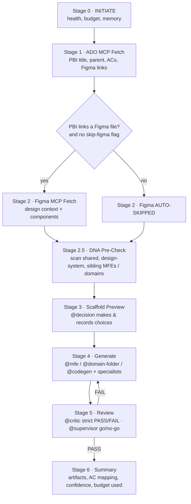

# eq-sparks — POC Plan

**Owner:** FE Solution Architect (EQ)
**Scope of this POC:** EQOne frontend (RootMFE + child MFEs + shared + design-system) **and** ExperienceAPI (BFF monorepo)
**Out of scope (for now):** Domain Services (.NET microservices) — separate track
**Reference only:** the `sparks` harness in this workspace (for ideas; eq-sparks is a fresh build)
**Status:** Draft for review

---

## 1. What we are proving

eq-sparks is a **central agentic harness** for the EQ frontend + BFF estate. One repo holds every agent, orchestrator, skill, guardrail and the "agentic OS" (cache, budget, memory). It is **synced into every consumer repo**, but the machinery stays hidden behind a `.eq-sparks/` folder — developers only ever see clean **agents and orchestrators** through their IDE (Copilot and Claude Code).

The POC succeeds when a developer can:

1. Run **`/scaffold <PBI>`** in any EQ repo and watch the staged orchestrator console (the visual you shared) run end-to-end.
2. The orchestrator **pulls the PBI from ADO via MCP**, and **if the PBI links a Figma file, automatically calls the Figma MCP**.
3. Agents generate code that is **cross-repo aware** — no duplicate code, no dead code, shared code lands in `eq-one-shared`, UI uses `eq-one-design-system` / Storybook, and the FE stays aligned to ExperienceAPI contracts.
4. **Supervisor / Decision / Critic** agents govern the run — planning, deciding at ambiguity, and strictly reviewing every other agent before anything is accepted.
5. The same staged console UX is reused by **every** orchestrator (scaffold, review, fix, contract-sync…).

---

## 2. Key decisions (locked for this POC)

| Decision | Choice |
|---|---|
| Orchestrator runtime | **GitHub Copilot chat modes + Claude Code agents** — both print the same staged markdown console. No custom extension. |
| Coverage | **All FE repos + ExperienceAPI** |
| Distribution | **`npx github:equiniti-org/eq-sparks init` (install.js / install.sh) + git sparse-checkout** — already implemented; renders into the consumer repo |
| Install modes | **Full (agentic)** and **Offline-only** (Copilot Enterprise) — see §4.3 |
| MCP / VS Code | **Multi-root `.code-workspace` with ONE shared `mcp.json`** (ADO + Figma) |
| Harness visibility | Full mode: machinery in gitignored `.eq-sparks/` + `.eq-sparks.yml`; agents/orchestrators surfaced via `.github` (and `.claude`). Offline mode: everything under `.github/` only |
| IDE profiles (now) | **Copilot, Claude Code** (adapters designed to add Cursor etc. later) |

### 2.1 Does the implementation plan change? (vs the repo already built)

No re-architecting — the existing `equiniti-org/eq-sparks` build matches this plan. Three small reconciliations only:

1. **Two install modes are now first-class.** Full (agentic) vs **offline-only** (Copilot Enterprise: `.github/` only, no cache/config, no Flow 1/3). Documented in §4.2–§4.3.
2. **Profiles start coarse.** The CLI ships `ui` and `backend` today; the finer FE sub-profiles (`fe-rootmfe`, `fe-childmfe`, `fe-shared`, `fe-designsystem`) become a Phase-3 refinement, not a blocker (§6).
3. **Phase 0 is largely done.** Foundation (CLI, adapters, install, action, bridge) already exists; the POC's remaining Phase-0 work is the multi-root workspace + shared `mcp.json` and verifying the offline render (§11).

Everything else — governance trio, scaffold orchestrator, console UX, cross-repo DNA check, MCP strategy — stands unchanged.

---

## 3. Repository topology

```
                          ┌──────────────────────────────┐
                          │   eq-sparks  (CENTRAL REPO)   │
                          │  agents · orchestrators ·     │
                          │  skills · guardrails · OS     │
                          └───────────────┬──────────────┘
                                          │  install script + sparse-checkout
              ┌───────────────┬───────────┼───────────────┬───────────────────┐
              ▼               ▼           ▼               ▼                   ▼
   FRONTEND  (EQOne)                                            BACKEND-FOR-FRONTEND
   ──────────────────────────────────────────────────         ───────────────────────
   eq-nexus-ui          RootMFE (the shell, loads MFEs)        ExperienceAPI  (monorepo)
   eq-one-saye-mfe      child MFE                               ├── src/domains/saye/
   eq-one-sip-mfe       child MFE                               ├── src/domains/sip/
   eq-one-shares-mfe    child MFE                               ├── src/domains/shares/
   eq-one-shared        layout · auth · common api · stores     └── (each domain folder
   eq-one-design-system facade over eq-one-studio Storybook         deploys independently)
```

**Frontend rules the agents must know:**

- `eq-nexus-ui` is the **RootMFE / shell** — owns routing, module wiring, cross-MFE contracts.
- Child MFEs (`saye`, `sip`, `shares`) are **independent** but must not duplicate code.
- `eq-one-shared` is the **home for common code** — layout, auth, common API clients, common Zustand stores. Anything reused **must move here**.
- `eq-one-design-system` is a **facade** that imports `eq-one-studio` Storybook and re-exports it. UI must consume components from here — **never hand-roll** what the design system already provides.

**ExperienceAPI rules the agents must know:**

- Single **monorepo**, one **folder per domain** (`saye`, `sip`, `shares`…), each **independently deployable**.
- Each domain **connects downstream APIs** and **"paints & polishes"** request/response shapes for the UI (it is a BFF, not business logic).
- It is **C#/ASP.NET**, so it reuses the .NET-style agents; the FE consumes its **API contracts**.

---

## 4. How the harness is delivered (hidden behind `.eq-sparks/`)

A post-install step sparse-checks the central repo into a **gitignored** `.eq-sparks/` folder, then **renders** clean, native files that the IDE reads:

```
<consumer repo>/
├── .eq-sparks/                 ← GITIGNORED · the "agentic OS" (hidden from devs)
│   ├── agents/                 source of truth for all agents
│   ├── orchestrators/          source of truth for all orchestrators
│   ├── skills/
│   ├── guardrails/
│   ├── profiles/               profile definitions (see §6)
│   ├── cache/                  story/PBI cache
│   ├── agent-memory/           rollback + run state
│   ├── budget/                 tool-call ceilings, token policy
│   └── telemetry/              cost/quality logs
│
├── .github/                    ← COMMITTED · what Copilot reads (devs see this)
│   ├── chatmodes/              *.chatmode.md  (orchestrators as Copilot modes)
│   ├── prompts/                *.prompt.md
│   ├── instructions/           *.instructions.md (path-scoped rules)
│   └── copilot-instructions.md
│
├── .claude/                    ← COMMITTED · what Claude Code reads (devs see this)
│   ├── agents/                 *.md subagents
│   ├── commands/               /scaffold, /review, ...
│   └── skills/
│
├── eq-one.code-workspace       ← COMMITTED · multi-root workspace (see §7)
└── .gitignore                  ← appends .eq-sparks/
```

**Why this split:** the agents and orchestrators are visible and reviewable in GitHub (clean, readable markdown), while the cache, budget, memory and telemetry — the noisy "OS" internals — stay out of sight and out of version control. One source of truth (`.eq-sparks/agents`) renders to both Copilot (`.github`) and Claude Code (`.claude`) formats, so the two IDEs never drift.

**Sync:** a `eq-sparks-sync` workflow re-runs sparse-checkout weekly (or on demand) and opens a PR if the rendered files changed. Developers review and merge — no surprise overwrites.

### 4.1 Central `eq-sparks` repo layout (as built)

The central repo already exists at `equiniti-org/eq-sparks`. Its top level:

```
eq-sparks/  (equiniti-org)
├── .github/                  agent issues + the repo's own CI
├── action/  · action.yml     reusable GitHub Action (drop-in for consumer pipelines)
├── adapters/                 IDE adapters — render canonical agents to copilot / claude-code (cursor later)
├── bridge/power-automate/    autonomous flow bridge (ADO PBI → run), EQ's Power Automate equivalent
├── cli/                      the eq-sparks CLI (init / sync / update + flags)
├── instructions/             path-scoped coding rules (shared baseline)
├── profiles/                 profile definitions (ui, backend, … see §6)
├── shared/                   shared agents, skills, guardrails, memory
├── install.js · install.sh   cross-platform bootstrap (npx entry)
├── package.json              npx github:equiniti-org/eq-sparks works from here
├── .eq-sparks.yml.example    per-repo config template
├── SAMPLE-PROMPTS.md          example orchestrator prompts
├── SCHEMA.md · README.md · CONTRIBUTING.md
```

> This is the single source of truth. Everything below (install, sync, render) flows from here.

### 4.2 Installation & flags

```bash
# Bootstrap a consumer repo (Node 20+), choosing a profile
npx github:equiniti-org/eq-sparks init --profile=ui

# Update the rendered files to the latest version
npx eq-sparks sync
```

| Command | Flag | Effect |
|---|---|---|
| `init` | `--profile=<name>` | Which profile to render (`ui`, `backend`, … §6) |
| `init` | `--ide=copilot,claude-code` | Which IDE adapter(s) to render (default both) |
| `init` | `--offline-only` | Render `.github/` only — no `.eq-sparks/` cache, no `.eq-sparks.yml` (see §4.3) |
| `sync` | — | Re-render the latest agents/skills into this repo |
| `update` | `--offline-only` | Pull the latest agents with **no network clone** needed |
| `update` | `--offline-only --profile=ui` | Update a specific profile in offline mode |

### 4.3 Two install modes

| | **Full (agentic) mode** | **Offline-only mode** (Copilot Enterprise) |
|---|---|---|
| Command | `init --profile=<p>` | `init --profile=<p> --offline-only` |
| Creates | `.github/` + `.eq-sparks/` cache + `.eq-sparks.yml` + `.vscode/mcp.json` | **`.github/` only** (agents, skills, guardrails, instructions, harness) + `.vscode/mcp.json` |
| Footprint | Full | Smaller — no cache, no config file |
| MCP (ADO + Figma) | ✅ | ✅ |
| Autonomous orchestration (Flow 1) | ✅ | ❌ |
| Resume / handover (Flow 3) | ✅ | ❌ |
| Best for | Teams running the full agent platform | Teams on **GitHub Copilot Enterprise only**, no orchestration |

> The three flows (from the sparks model): **Flow 1** autonomous PBI→PR, **Flow 2** IDE-assisted, **Flow 3** cloud→IDE handoff/resume. Offline-only keeps Flow 2 (the everyday Copilot assist) and drops 1 and 3 to stay lightweight.

---

## 5. Agents

Agents live **once** in `eq-sparks` and are imported everywhere. Three layers:

### 5.1 Governance agents (NEW — the heart of your request)

These run on **every** orchestrator and review the others **strictly**.

| Agent | Role | Behaviour |
|---|---|---|
| **@supervisor** | Owns the run | Plans the stages, allocates the tool-call budget, enforces guardrails, makes the go / no-go call between stages, aggregates the final summary. Nothing proceeds without it. |
| **@decision** | Resolves ambiguity | At each fork (vague PBI, missing contract, unclear placement) it inspects the PBI + repos and makes a **defensible decision**, recording the rationale in the run log and surfacing it in the summary for human review. |
| **@critic** | Adversarial reviewer | Reviews every other agent's output against EQ standards and returns **PASS / FAIL with required changes**. A FAIL **blocks** the stage until fixed. Deliberately strict — it is the quality gate, not a cheerleader. |

> Flow: `@supervisor` plans → worker agents produce → `@critic` reviews → if FAIL, worker revises → `@supervisor` decides go/no-go. `@decision` is consulted whenever the path is ambiguous.

### 5.2 Core build / test / quality agents (shared, TS + C# variants)

`@architect` · `@codegen` · `@reviewer` · `@tester` · `@integration-tester` · `@contract-tester` · `@security` · `@scanner` · `@docs` · `@perf`

### 5.3 Frontend (EQOne) specialist agents

| Agent | Knows about | Job |
|---|---|---|
| **@mfe** | RootMFE + child MFEs | Scaffold/extend a child MFE, wire it into `eq-nexus-ui`, respect MFE boundaries |
| **@shared-curator** | `eq-one-shared` | Detect duplicated/common code across MFEs → **move it to shared**; flag **dead code** for removal |
| **@design-system** | `eq-one-design-system` + Storybook | Force UI to use design-system components; block hand-rolled equivalents |
| **@state** | Zustand | Apply EQ store patterns; common stores go to `eq-one-shared` |
| **@contract** | ExperienceAPI contracts | Keep FE types/clients aligned to the BFF contract; fail on drift |
| **@a11y** | WCAG | Check every screen for accessibility |

### 5.4 ExperienceAPI (BFF) specialist agents

| Agent | Job |
|---|---|
| **@domain-folder** | Scaffold a new domain folder in the monorepo, independently deployable |
| **@bff-shaper** | "Paint & polish" request/response shapes for the UI |
| **@downstream-connector** | Wire downstream API clients with resilience (Polly), timeouts, retries |
| **@contract-publisher** | Publish the API contract that FE `@contract` consumes |

---

## 6. Profiles & IDE options

A developer installs eq-sparks by **choosing a profile + IDE**. The profile decides which agents/skills/rules render into that repo; the IDE decides the output format.

```
npx github:equiniti-org/eq-sparks init --profile=<profile> --ide=copilot,claude-code
```

**Today (as built)** the CLI ships two coarse profiles — `ui` and `backend`. For EQOne we propose splitting `ui` into FE sub-profiles so each repo type gets exactly the right agents (this is a small `profiles/` addition, no engine change):

| Profile (proposed) | Maps to today | For repo | Pulls in |
|---|---|---|---|
| `fe-rootmfe` | `ui` | eq-nexus-ui | @mfe, @design-system, @contract, routing/shell rules, governance trio |
| `fe-childmfe` | `ui` | saye / sip / shares MFE | @mfe, @state, @design-system, @contract, @a11y, governance trio |
| `fe-shared` | `ui` | eq-one-shared | @shared-curator, @state, common-code rules, governance trio |
| `fe-designsystem` | `ui` | eq-one-design-system | @design-system, Storybook facade rules, governance trio |
| `be-experienceapi` | `backend` | ExperienceAPI | @domain-folder, @bff-shaper, @downstream-connector, @contract-publisher, governance trio |

> Splitting `ui` into the four FE sub-profiles is a Phase-3 task. Until then, all FE repos can install `--profile=ui` and still work; the sub-profiles just sharpen which agents load where.

| IDE adapter | Renders to | Status |
|---|---|---|
| `copilot` | `.github/chatmodes`, `.github/prompts`, `.github/instructions` | POC |
| `claude-code` | `.claude/agents`, `.claude/commands`, `.claude/skills` | POC |
| `cursor` | `.cursor/rules` | later |

> Same agent source → multiple IDE formats. Adding Cursor later is one new adapter, no content rewrite.

---

## 7. MCP & the multi-root workspace (the "biggest issue")

Developers open **2–3 repos at once**, so per-repo `mcp.json` would spin up **duplicate** ADO/Figma servers and conflict. Solution: **one multi-root workspace, one shared `mcp.json`.**

`eq-one.code-workspace` (committed to RootMFE, opens the whole estate):

```jsonc
{
  "folders": [
    { "path": "../eq-nexus-ui" },
    { "path": "../eq-one-shared" },
    { "path": "../eq-one-design-system" },
    { "path": "../eq-one-saye-mfe" },
    { "path": "../eq-one-sip-mfe" },
    { "path": "../eq-one-shares-mfe" },
    { "path": "../ExperienceAPI" }
  ],
  "settings": {
    "github.copilot.chat.mcp.configPath": "${workspaceFolder}/.vscode/mcp.json"
  }
}
```

A **single** `.vscode/mcp.json` at the workspace root defines both servers **once**:

```jsonc
{
  "servers": {
    "ado":   { "type": "http", "url": "https://<ado-mcp-endpoint>" },
    "figma": { "type": "http", "url": "https://<figma-mcp-endpoint>" }
  }
}
```

**Post-install behaviour:**

- On first install in the parent folder, eq-sparks writes/updates `eq-one.code-workspace` and the **single** root `mcp.json` — not one per repo.
- Auth uses **browser/OAuth login**, so **no tokens are committed**.
- If a dev opens a single repo standalone, a fallback minimal `.vscode/mcp.json` is rendered, but the **recommended** entry point is the workspace file.

> Net effect: open the workspace once → ADO + Figma MCP available across all 7 repos, defined in exactly one place.

---

## 8. The Scaffold Orchestrator

The flagship orchestrator. Connects **ADO MCP**, then **conditionally Figma MCP**, runs a cross-repo "DNA" pre-check, generates, and is gated by the governance trio.



**Figma gating logic (Stage 1 → 2):** the ADO fetch returns the PBI's linked artifacts. If a **Figma URL is present** and the run was **not** started with `[skip-figma]`, Stage 2 calls the Figma MCP for design context + component names. Otherwise it prints **AUTO-SKIPPED** with the reason (mirrors your screenshot).

**DNA Pre-Check (Stage 2.5) — cross-repo awareness:** before generating, the orchestrator scans the relevant repos for existing equivalents:

- FE run → scans `eq-one-design-system` (is there already a component?), `eq-one-shared` (is there a common store/util?), and sibling MFEs (duplication?).
- BFF run → scans existing domain folders for a similar endpoint/shaper.
- Result feeds `@decision`: **reuse**, **extend**, or **create** — and `@shared-curator` flags anything that should live in shared. This is how "no repeat code, no dead code, move to shared" is enforced **before** a line is written.

---

## 9. Orchestrator console UX (shared by ALL orchestrators)

Every orchestrator prints the **same three-part console**: an **Intro card**, a block **per stage**, and a **Summary**. This is the visual from your screenshots, standardised. Below is the contract; all orchestrators (scaffold, review, fix-pentest, contract-sync, refactor) reuse it.

### 9.1 Intro card (run header)

```
╔══════════════════════════════════════════════════════════════════╗
║  eq-sparks · SCAFFOLD ORCHESTRATOR                    PBI 38489     ║
╠══════════════════════════════════════════════════════════════════╣
║  Plan (6 stages)                                                   ║
║    0 INITIATE → 1 ADO Fetch → 2 Figma Fetch → 2.5 DNA Pre-Check    ║
║    → 3 Preview → 4 Generate → 5 Review → 6 Summary                 ║
║                                                                    ║
║  Agents on this run                                                ║
║    @supervisor  @decision  @critic                                 ║
║    @mfe  @state  @design-system  @contract  @a11y  @tester         ║
║                                                                    ║
║  Tools (MCP)        ADO ✓   Figma ⏳ (conditional)                 ║
║  Profile            fe-childmfe        IDE   copilot | claude-code  ║
║  Budget             ceiling 60 tool calls · tokens tracked         ║
║  Target confidence  ≥ 90% before "ready to merge"                  ║
╚══════════════════════════════════════════════════════════════════╝
```

### 9.2 Per-stage block

```
── Stage 1/6 — ADO MCP Fetch ──────────────────────────────────────
Loading: ADO-MCP-Fetch.agent.md   Skill: ado-fetch-workflow.md
Status:  ✅ Cache hit (using cached ADO data)

   Field         Value
   Title         [EQOne] SIP dashboard — add holdings filter
   Parent        UI State Management Modernization (38486)
   Figma links   1 found  → Stage 2 will run
   AC scenarios  7

── Stage 2/6 — Figma MCP Fetch ────────────────────────────────────
Status:  🎯 RUNNING (Figma link present, no skip-figma flag)
   Design context   sip-holdings-filter (3 frames)
   Components       FilterBar, Chip, ResultList  → match to design-system

── Stage 2.5 — DNA Pre-Check ──────────────────────────────────────
Scanning eq-one-design-system, eq-one-shared, sibling MFEs…
   FilterBar      ✅ exists in design-system → REUSE
   useHoldings    ⚠️ similar store in eq-one-shared → EXTEND (not duplicate)
   ResultList     ➕ new → create in eq-one-sip-mfe
@decision: reuse 1, extend 1, create 1 — rationale logged.
```

### 9.3 Summary (final)

```
╔══════════════════════════════════════════════════════════════════╗
║  ✅ SCAFFOLD COMPLETE — PBI 38489                                  ║
╠══════════════════════════════════════════════════════════════════╣
║  Acceptance criteria      7 / 7 mapped        Coverage 100%        ║
║  @critic verdict          PASS (2 revisions)                       ║
║  @supervisor              GO                                       ║
║                                                                    ║
║  Artifacts (.eq-sparks/artifacts/)                                 ║
║    SCAFFOLD-SUMMARY-PBI-38489.md      executive summary            ║
║    IMPLEMENTATION-CHECKLIST.md        AC-by-AC tracking            ║
║    CODE-SNIPPETS.md / generated files                              ║
║                                                                    ║
║  Cross-repo actions                                                ║
║    REUSE   FilterBar (design-system)                               ║
║    EXTEND  useHoldings store (eq-one-shared)                       ║
║    CREATE  ResultList (eq-one-sip-mfe)                             ║
║                                                                    ║
║  Budget used   31 / 60 tool calls · tokens 32K · est. $0.13        ║
║  Confidence    93%        Ready for: developer review              ║
╚══════════════════════════════════════════════════════════════════╝
```

> Every orchestrator emits exactly these three parts. Only the stage list and agent roster change. This gives the whole platform one recognisable, reviewable "shape".

### 9.4 Other orchestrators (same console, different stages)

| Orchestrator | Command | Stages (besides Intro/Summary) |
|---|---|---|
| **Scaffold** | `/scaffold <PBI>` | ADO → Figma? → DNA → Preview → Generate → Review |
| **Review** | `/review <PR>` | Fetch diff → 6-lens review → @critic → @supervisor verdict |
| **Fix pentest** | `/fix-pentest <report>` | Parse findings → locate (FE/BFF) → fix → re-verify |
| **Contract sync** | `/contract-sync <domain>` | Read BFF contract → diff FE types → patch → @critic |
| **Move to shared** | `/refactor-shared` | DNA scan → find duplication → move to eq-one-shared → update imports |

---

## 10. Guardrails, budget, memory (the hidden OS)

All inside `.eq-sparks/`, never shown to developers, enforced by `@supervisor`:

- **Budget:** per-run tool-call ceiling (e.g. 60) + token tracking. Run pauses and asks if it would exceed.
- **Guardrails:** no secrets committed, no PII in logs, auth on every endpoint/route, no dead code left behind, common code must move to shared, UI must use design-system, FE must match BFF contract. `@critic` enforces; violations block.
- **Cache:** ADO/Figma responses cached per PBI to keep reruns cheap (the "Cache hit" line).
- **Agent-memory / rollback:** each run snapshots state so a run can be resumed or rolled back.
- **Telemetry:** tokens, cost, duration per agent call → surfaced in the summary.

---

## 11. Phase plan

> No fixed dates — pace depends on how many people are on the POC. Each phase ends with something runnable.

### Phase 0 — Harness foundation  ✅ largely built
- The **eq-sparks** central repo exists (`equiniti-org/eq-sparks`) with `install.js`/`install.sh`, `cli`, `adapters`, `profiles`, `instructions`, `shared`, the GitHub `action`, and the `bridge/power-automate` flow bridge.
- `init` / `sync` / `update` with `--profile` and `--offline-only` flags work (§4.2).
- **Remaining for the POC:** the **multi-root `eq-one.code-workspace`** + single shared **`mcp.json`** (ADO + Figma, browser-login), and confirming the offline-only render matches §4.3.
- **Exit:** installing in any repo produces clean files in either mode, and ADO + Figma MCP connect once across the multi-root workspace.

### Phase 1 — Governance + core agents + OS
- Author **@supervisor, @decision, @critic** and the core agents.
- Stand up the hidden OS: **budget, guardrails, cache, agent-memory, telemetry**.
- **Exit:** an agent run is planned by @supervisor, reviewed by @critic, and logged — visible only as clean agents in the IDE.

### Phase 2 — Scaffold orchestrator + console UX
- Build `/scaffold` with the full staged flow and the **ADO MCP fetch**.
- Implement the **conditional Figma MCP** call (gated on PBI Figma link + `skip-figma`).
- Implement the **shared console UX** (Intro / Stage / Summary) so all future orchestrators inherit it.
- **Exit:** `/scaffold <PBI>` runs end-to-end on a sample PBI in both Copilot and Claude Code with identical console output.

### Phase 3 — Profiles: FE depth + ExperienceAPI
- Wire the **profiles** (`fe-rootmfe`, `fe-childmfe`, `fe-shared`, `fe-designsystem`, `be-experienceapi`).
- FE cross-repo awareness: **DNA pre-check**, `@shared-curator`, `@design-system`, `@contract` (no dup / no dead code / move-to-shared / use Storybook / contract-aligned).
- ExperienceAPI: `@domain-folder`, `@bff-shaper`, `@downstream-connector`, `@contract-publisher` (monorepo, independent deploy, downstream wiring, request/response shaping).
- **Exit:** scaffolding a feature in a child MFE correctly reuses design-system components, pushes common code to shared, and aligns to the BFF contract; scaffolding a BFF domain produces an independently-deployable folder.

### Phase 4 — More orchestrators (reuse the console)
- `/review`, `/fix-pentest`, `/contract-sync`, `/refactor-shared` — all on the same console UX and governance trio.
- **Exit:** at least two more orchestrators run with the identical look-and-feel.

### Phase 5 — POC run + demo
- Run real ADO PBIs across **RootMFE, a child MFE, shared, design-system, and ExperienceAPI**.
- Measure (below), capture a demo of the console, and write up findings.
- **Exit:** signed-off POC with evidence and a go/no-go for wider rollout.

---

## 12. POC success criteria

- `/scaffold` runs end-to-end from a **real ADO PBI** in Copilot **and** Claude Code with the same console.
- Figma MCP is **auto-called when (and only when)** the PBI links a Figma file.
- DNA pre-check demonstrably **prevents a duplicate** and **routes common code to `eq-one-shared`** at least once.
- A generated FE change **uses a design-system component** instead of a hand-rolled one.
- `@critic` **blocks** at least one substandard output and forces a fix.
- MCP is configured **once** for the whole multi-root workspace (no duplicate servers).
- Developers see **only** agents/orchestrators — the `.eq-sparks/` OS stays hidden.

---

## 13. Open questions / assumptions to confirm

1. **ADO MCP + Figma MCP endpoints** — are these the official Microsoft ADO MCP and Figma MCP servers you already use, or internal EQ-hosted ones? (Affects the `mcp.json` URLs and auth.)
2. **eq-one-studio** — confirmed as the source Storybook that `eq-one-design-system` re-exports? Any access/package details for agents to read it?
3. **Repo cloning convention** — do developers clone all repos as siblings under one parent folder (needed for the multi-root workspace `../` paths)? If not, we need a discovery step.
4. **ExperienceAPI contract format** — OpenAPI/Swagger per domain? That is what `@contract-publisher` → FE `@contract` will sync against.
5. **Module federation** — is the RootMFE wiring Module Federation, single-spa, or another approach? `@mfe` needs the exact mechanism.
6. **Budget ceiling** — is 60 tool calls per run a sensible default for the POC, or do you want it higher/lower?
7. **eq-sparks repo home** — which GitHub org/owner hosts the central repo, and who approves changes to shared agents/guardrails?

---

*Reference: the `sparks` harness in this workspace was used only for shape and ideas (orchestrator → agents → skills, sparse-checkout distribution, staged console, curated learning loop). eq-sparks is a fresh, EQ-specific build.*
